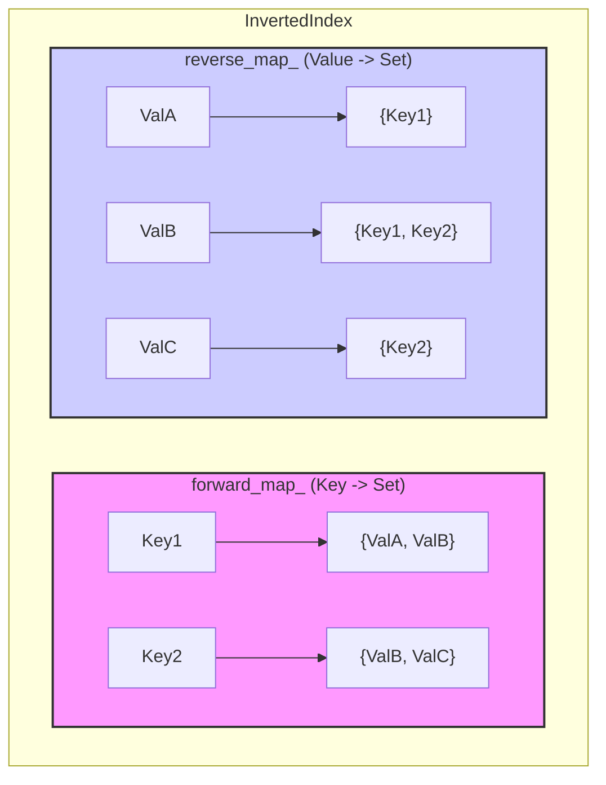

# `InvertedIndex<Key, Value, HashKey, EqualKey, HashValue, EqualValue>`

## Overview

`InvertedIndex` is a header-only C++17 utility that provides a bi-directional, reverse multi-mapping container. It allows efficient management and querying of many-to-many relationships between keys and values.

Essentially, it maintains two internal maps:
1.  **Forward Map**: `Key → Set<Value>` (e.g., a document maps to a set of tags)
2.  **Reverse Map**: `Value → Set<Key>` (e.g., a tag maps to a set of documents that have it)

This structure enables quick lookups in both directions: finding all values associated with a key, and finding all keys associated with a value.

## Motivation

In many systems, managing relationships where an entity can be associated with multiple other entities (and vice-versa) is common. Examples include:
*   Documents and tags
*   Users and groups
*   Products and categories/features
*   Nodes in a graph and their neighbors (for undirected edges)

While `std::unordered_multimap` can handle one-to-many mappings, it doesn't inherently provide an efficient reverse lookup. `InvertedIndex` addresses this by explicitly storing and maintaining both forward and reverse mappings, ensuring that operations like finding "all documents for a tag" are as efficient as finding "all tags for a document."

## Use Cases

*   **Search Engines**: Mapping words to document IDs containing them.
*   **Tagging Systems**: Associating items (documents, images, posts) with multiple descriptive tags.
*   **Classification Systems**: Mapping labels to object IDs that fall under that label.
*   **Recommendation Engines**: Linking users to items they've interacted with, and items to users who've interacted with them.
*   **Graph-like Structures**: Representing bi-directional relationships between nodes.
*   **Entity-Attribute Systems**: Finding all entities that possess a certain attribute.

## Features

*   **Bi-directional Mapping**: Efficiently query `Key → Set<Value>` and `Value → Set<Key>`.
*   **Header-Only**: Easy to integrate by just including `inverted_index.h`.
*   **C++17**: Utilizes modern C++ features.
*   **Customizable Hashing/Equality**: Supports custom hash functions and equality predicates for both `Key` and `Value` types via template parameters.
*   **Value Semantics**: Supports copy and move construction/assignment.
*   **Efficient Operations**: Most operations (add, remove, lookup) are amortized O(1) on average, thanks to the underlying `std::unordered_map` and `std::unordered_set`.

## API

```cpp
template <
    typename Key,
    typename Value,
    typename HashKey = std::hash<Key>,
    typename EqualKey = std::equal_to<Key>,
    typename HashValue = std::hash<Value>,
    typename EqualValue = std::equal_to<Value>
>
class InvertedIndex {
public:
    // --- Type Aliases ---
    using KeySet = std::unordered_set<Key, HashKey, EqualKey>;
    using ValueSet = std::unordered_set<Value, HashValue, EqualValue>;

    // --- Constructors ---
    InvertedIndex(); // Default constructor

    // Copy semantics
    InvertedIndex(const InvertedIndex& other);
    InvertedIndex& operator=(const InvertedIndex& other);

    // Move semantics
    InvertedIndex(InvertedIndex&& other) noexcept;
    InvertedIndex& operator=(InvertedIndex&& other) noexcept;

    // --- Core Methods ---

    // Adds a mapping between key and value.
    // Updates both forward (key -> {value, ...}) and reverse (value -> {key, ...}) maps.
    // Idempotent: adding an existing mapping has no effect.
    void add(const Key& key, const Value& value);

    // Removes a specific mapping between key and value.
    // If this causes a key to have no more values, the key is removed from the forward map.
    // If this causes a value to have no more keys, the value is removed from the reverse map.
    void remove(const Key& key, const Value& value);

    // Removes a key and all its associated value mappings.
    // For each value previously mapped to this key, the key is removed from that value's reverse mapping.
    // If any such value then has no more associated keys, it is removed from the reverse map.
    void remove_key(const Key& key);

    // Removes a value and all its associated key mappings.
    // For each key previously mapped to this value, the value is removed from that key's forward mapping.
    // If any such key then has no more associated values, it is removed from the forward map.
    void remove_value(const Value& value);

    // Returns a const reference to the set of values associated with the given key.
    // If the key does not exist, returns a const reference to a static empty ValueSet.
    const ValueSet& values_for(const Key& key) const;

    // Returns a const reference to the set of keys associated with the given value.
    // If the value does not exist, returns a const reference to a static empty KeySet.
    const KeySet& keys_for(const Value& value) const;

    // Checks if a specific mapping between key and value exists.
    // Returns true if key is mapped to value, false otherwise.
    bool contains(const Key& key, const Value& value) const;

    // Checks if the InvertedIndex contains any mappings.
    // Returns true if empty, false otherwise.
    bool empty() const;

    // Removes all keys, values, and mappings from the InvertedIndex.
    void clear();

    // --- Iteration ---
    // Provides const iterators to traverse the forward_map_ (Key -> ValueSet).
    typename std::unordered_map<Key, ValueSet, HashKey, EqualKey>::const_iterator begin() const;
    typename std::unordered_map<Key, ValueSet, HashKey, EqualKey>::const_iterator end() const;

    // --- Size Information ---
    // Returns the number of unique keys in the index.
    size_t key_count() const;

public: // Note: These are public for testing, typically would be private.
    static const KeySet EMPTY_KEY_SET;
    static const ValueSet EMPTY_VALUE_SET;
};
```

### Template Parameters

*   `Key`: The type of the keys.
*   `Value`: The type of the values.
*   `HashKey`: Hash function for `Key`. Defaults to `std::hash<Key>`.
*   `EqualKey`: Equality comparison for `Key`. Defaults to `std::equal_to<Key>`.
*   `HashValue`: Hash function for `Value`. Defaults to `std::hash<Value>`.
*   `EqualValue`: Equality comparison for `Value`. Defaults to `std::equal_to<Value>`.

You only need to specify custom hash/equality functors if the default `std::hash` or `std::equal_to` are not suitable for your `Key` or `Value` types (e.g., for custom structs without `std::hash` specializations).

## Internal Structure

The `InvertedIndex` internally uses two primary data structures:

*   `forward_map_`: An `std::unordered_map<Key, ValueSet, HashKey, EqualKey>`
    *   Maps each `Key` to an `std::unordered_set<Value, HashValue, EqualValue>` of its associated values.
*   `reverse_map_`: An `std::unordered_map<Value, KeySet, HashValue, EqualValue>`
    *   Maps each `Value` to an `std::unordered_set<Key, HashKey, EqualKey>` of its associated keys.



When an operation like `add(Key1, ValA)` is performed:
1.  `ValA` is added to the `ValueSet` associated with `Key1` in `forward_map_`.
2.  `Key1` is added to the `KeySet` associated with `ValA` in `reverse_map_`.

Similarly, `remove` operations update both maps to maintain consistency.

## Example Usage

```cpp
#include "inverted_index.h"
#include <iostream>
#include <string>

// Helper to print sets
template<typename S>
void print_set(const S& set, const std::string& name) {
    std::cout << name << ": { ";
    for (const auto& item : set) std::cout << item << " ";
    std::cout << "}" << std::endl;
}

int main() {
    InvertedIndex<std::string, std::string> article_tags;

    // Add articles and their tags
    article_tags.add("ArticleA", "C++");
    article_tags.add("ArticleA", "Programming");
    article_tags.add("ArticleB", "Python");
    article_tags.add("ArticleB", "AI");
    article_tags.add("ArticleC", "C++");
    article_tags.add("ArticleC", "Performance");

    // What tags does ArticleA have?
    const auto& tags_A = article_tags.values_for("ArticleA");
    print_set(tags_A, "ArticleA tags"); // Output: ArticleA tags: { C++ Programming } (order may vary)

    // Which articles are tagged "C++"?
    const auto& articles_cpp = article_tags.keys_for("C++");
    print_set(articles_cpp, "C++ articles"); // Output: C++ articles: { ArticleA ArticleC } (order may vary)

    // Check if ArticleB is tagged "Performance"
    bool has_perf = article_tags.contains("ArticleB", "Performance");
    std::cout << "ArticleB tagged 'Performance': " << (has_perf ? "Yes" : "No") << std::endl; // Output: No

    // Remove "C++" tag from ArticleA
    article_tags.remove("ArticleA", "C++");
    print_set(article_tags.values_for("ArticleA"), "ArticleA tags (updated)"); // Output: { Programming }
    print_set(article_tags.keys_for("C++"), "C++ articles (updated)"); // Output: { ArticleC }

    return 0;
}
```

## Design Constraints & Considerations

*   **C++17**: Leverages features from C++17.
*   **Header-Only**: Simplifies integration.
*   **`std::unordered_map` + `std::unordered_set`**: These are the core internal data structures, providing good average-case performance for hash-based operations.
*   **Value Semantics**: Copyable and movable. Deep copies are performed.
*   **Efficiency**:
    *   `add`, `remove(key,value)`, `contains`, `values_for`, `keys_for`: Amortized O(1) on average, assuming good hash function performance. Worst case can be O(N) for the set/map operations if hash collisions are pathologically bad, or O(size of set) for some internal set operations.
    *   `remove_key`: Proportional to the number of values associated with the key.
    *   `remove_value`: Proportional to the number of keys associated with the value.
    *   `clear`: Proportional to the total number of elements.
*   **Thread Safety**: The `InvertedIndex` class itself is **not** thread-safe for concurrent writes. If thread safety is required, external synchronization mechanisms (like `std::mutex`) must be used, or a dedicated thread-safe wrapper would need to be implemented.

## Future Enhancements (Not Implemented)

*   **Thread-safe wrapper**: A `ConcurrentInvertedIndex` for safe multi-threaded access.
*   **Size-limited (bounded) variant**: An index that evicts entries based on some policy (e.g., LRU) when a size limit is reached.
*   **More complex iterators**: E.g., iterating over all `(Key, Value)` pairs directly.
